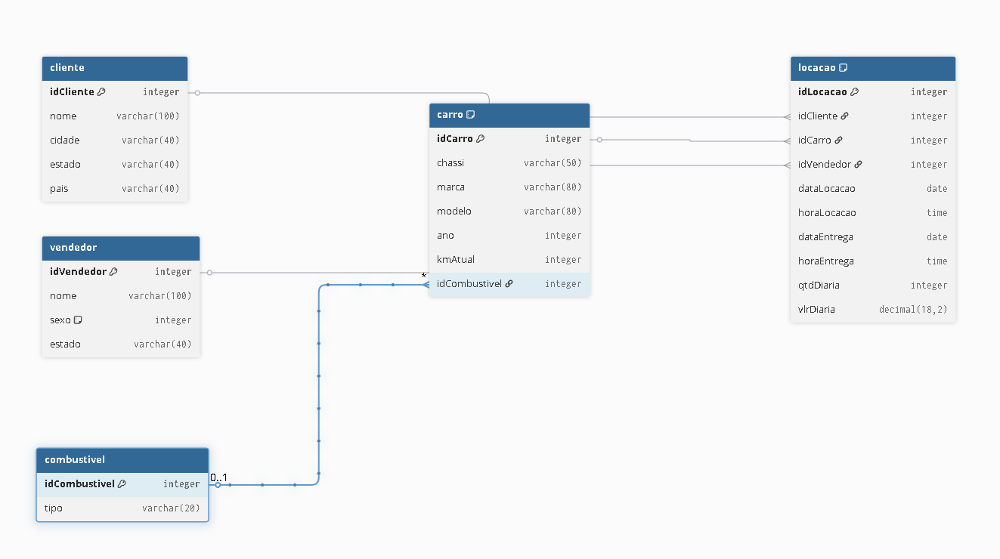
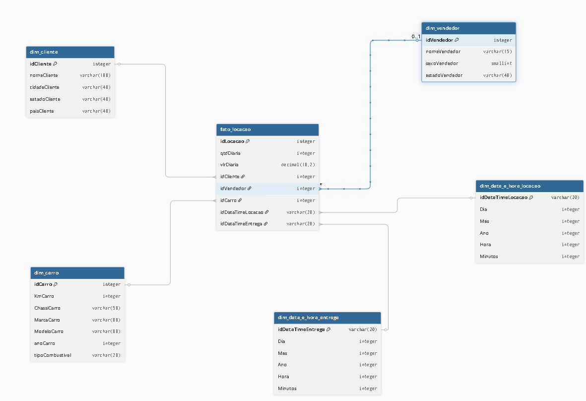

# 📋 Etapas

##  Criação do Modelo Relacional
- Após realizar o download da tabela bruta, fiz normalização da tabela `tb_locacao` para um modelo relacional.
  

    
  

## Criação do Modelo Dimensional a partir do Relacional
- Depois criei o modelo dimensional a partir do relacional no esquema estrela. Foram criadas as dimensões importantes e mescladas algumas tabelas e também a criação da tabela fato.
  

    
  

  
## Criação do Script SQL `ModeloRelacional.sql`
- Este script, ao ser executado, gera as tabelas e atributos correspondentes ao modelo relacional.
  [Modelo Relacional SQL](etapa-2/ModeloRelacional.sql)

## Criação do Script SQL `populandoTabelas.sql`
- Este script, ao ser executado, mescla alguns dados repetidos na tabela `tb_locacao`, como `tipoCombustivel`, `cidade`, `carros`, etc., e adiciona na tabela correspondente. Além disso, todas as informações contidas em `tb_locacao` são migradas para a nova tabela relacional, preservando os dados.
  [Inserção dos Dados SQL](etapa-2/populandoTabelas.sql)

## Criação do Script SQL `ModeloDimensional.sql`
- Ao executar o script, serão criadas *views* das tabelas dimensões e a tabela fato, conforme mostrado no modelo dimensional. Essas *views* serão criadas a partir do modelo relacional.
  [Modelo Dimensional SQL](etapa-3/ModeloDimensional.sql).
  Aqui as imagens de como ficaram as views criadas. [Views Modelo Dimensional SQL](/Sprint%201/Evidencias/ViewsDimensional.png)