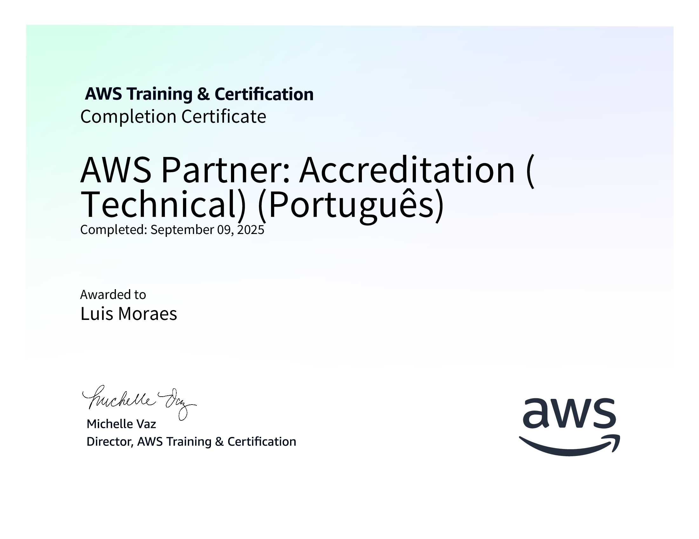

# 🚀 Sprint 3 – Docker, ETL, Regex e AWS

Este documento resume todo o conteúdo estudado e desenvolvido na **Sprint 3**, incluindo exercícios práticos, guia teórico e o desafio final.  
O foco da sprint foi aplicar **Docker** para conteinerização de aplicações em Python, desenvolver um pipeline **ETL + análise de dados**, aprofundar em **expressões regulares (Regex)** e concluir um curso oficial da **AWS**.

---

## 📚 Conteúdos abordados

- Fundamentos de **Docker**:
  - Imagens, contêineres e `docker build` / `docker run`
  - Criação de **Dockerfile**
  - Uso do **docker-compose** para orquestração de múltiplos serviços
- Conceitos de **ETL (Extract, Transform, Load)**
- Limpeza e transformação de dados com **Pandas**
- Geração de relatórios e gráficos com **Matplotlib**
- Organização de projetos com pastas estruturadas e versionamento
- **Guia completo de Regex em Python** (expressões regulares para busca, substituição, validação e parsing)
- Curso concluído: **AWS Partner: Accreditation (Technical) – Português**

---

## 📝 Exercícios realizados

### 1️⃣ **Exercício Carguru**
- Arquivo `carguru.py` encapsulado em imagem Docker.
- Execução de contêiner com Python 3.
- Evidência: contêiner rodando corretamente.

### 2️⃣ **Exercício de mascaramento de strings**
- Script que recebe strings, gera hash com **SHA-1** e imprime o resultado.
- Encapsulado em contêiner com Dockerfile próprio.
- Evidência: execução interativa com entrada de dados e saída mascarada.

📂 **Evidências**  

- [Docker Images](Evidencias/Exercicios/DockerImages.png)
- [Execução Carguru](Evidencias/Exercicios/DockerRUN-Carguru.png)  
- [Execução Mascarar Dados](Evidencias/Exercicios/DockerRUN-MascararDados.png)  

---

## 📖 Guia completo sobre Regex em Python

Durante a sprint, também foi produzido e estudado um guia prático e teórico sobre **Regex em Python**, incluindo:  
- Sintaxe básica e operadores (`. ^ $ * + ? {}` etc.)  
- Classes de caracteres (`\d`, `\w`, `\s`) e intervalos  
- Agrupamentos, grupos de captura e retrovisores  
- Lookahead e lookbehind  
- Substituições (`re.sub`) e buscas (`re.findall`, `re.match`, `re.search`)  
- Exemplos aplicados ao tratamento de dados textuais reais  

Esse guia foi utilizado para enriquecer os scripts de ETL e normalização de texto.

---

## 🎯 Desafio Final – ETL + Análise de Turnês Musicais

Foi desenvolvido um pipeline completo com duas etapas:

1. **ETL**: leitura do CSV `concert_tours_by_women.csv`, limpeza e normalização → saída `csv_limpo.csv`  
2. **JOB**: análises estatísticas e geração de gráficos → saídas `respostas.txt`, `Q4.png` e `Q5.png`

📂 **Arquivos principais**  
- [etl.py](Desafio/etapa-1/etl.py)  
- [job.py](Desafio/etapa-2/job.py)  
- [docker-compose.yml](Desafio/docker-compose.yml)  

📊 **Evidências**  
- [CSV Limpo](Evidencias/Desafio/CSVlimpo.png)  
- [Respostas.txt](Evidencias/Desafio/respostas.txt.png)  
- [Q4.png](Evidencias/Desafio/Q4png.png)  
- [Q5.png](Evidencias/Desafio/Q5png.png)  
- [Dockerfile Etapa 1](Evidencias/Desafio/DockerfileETAPA1.png)  
- [Dockerfile Etapa 2](Evidencias/Desafio/DockerfileETAPA2.png)  
- [Build docker-compose](Evidencias/Desafio/DOCKERcomposeBUILD.png)  
- [Execução docker-compose up](Evidencias/Desafio/DOCKERcomposeUP.png)  

---

## ☁️ Curso AWS Partner: Accreditation (Technical)

Além dos exercícios e do desafio, foi concluído o curso **AWS Partner: Accreditation (Technical)** em português.  
Principais tópicos:  
- Fundamentos de computação em nuvem  
- Serviços centrais da AWS (EC2, S3, RDS, VPC, IAM)  
- Conceitos de arquitetura segura e escalável  
- Princípios de boas práticas no uso da AWS  

Essa formação agregou conhecimento sobre infraestrutura em nuvem, complementando o aprendizado prático de conteinerização com Docker.

---

# ✅ Conclusão da Sprint 3

Nesta sprint, foi possível:
- Aplicar conceitos de **conteinerização** com Docker  
- Desenvolver scripts em Python para **mascaramento de dados** e **análises estatísticas**  
- Criar um pipeline **ETL + análise** totalmente automatizado com **docker-compose**  
- Produzir **relatórios e gráficos** reprodutíveis e organizados  
- Aprofundar conhecimentos em **Regex com Python** para manipulação avançada de textos  
- Concluir uma formação oficial da **AWS**, agregando visão de **cloud computing**  

📌 Resultado: uma sprint completa que uniu **infraestrutura + ciência de dados + cloud**, consolidando o aprendizado em conteinerização, análise de dados e arquitetura de nuvem.

# 🏆 Certificados
## 📜 AWS Partner: Credenciamento (Técnico) (Português) | AWS Partner: Accreditation(Technical) (Portuguese)

