# 🚀 Sprint 4
## 📚 Conteúdos abordados
- Amazon S3 – criação de bucket e hospedagem de site estático  
- Amazon Athena – consultas SQL em arquivos no S3  
- AWS Lambda – criação de funções, uso de bibliotecas externas com Layers  
- **Docker** – utilizado para empacotamento de dependências (Pandas/Numpy) em uma Layer para o Lambda  
- Integração entre serviços AWS (S3 + Athena + Lambda + Docker)  
- Fundamentos de Cloud Computing com AWS Cloud Quest  
- AWS Partner: fundamentos de vendas e proposta de valor da nuvem  
- AWS Partner: economia e boas práticas financeiras na nuvem AWS  

---

## 📝 Exercícios realizados

### 🔹 Lab AWS S3
- Criação de bucket e configuração de hospedagem estática.  
- Upload de `index.html`, `404.html` e `nomes.csv`.  
- Liberação de acesso público via política de bucket.  

**Evidências:**  
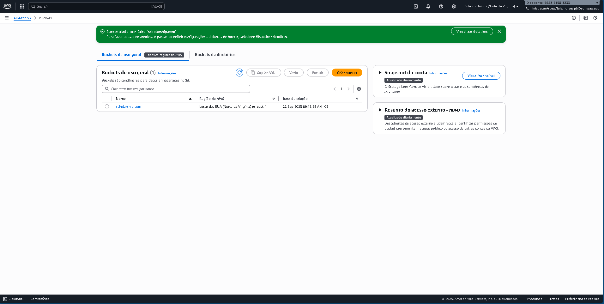  
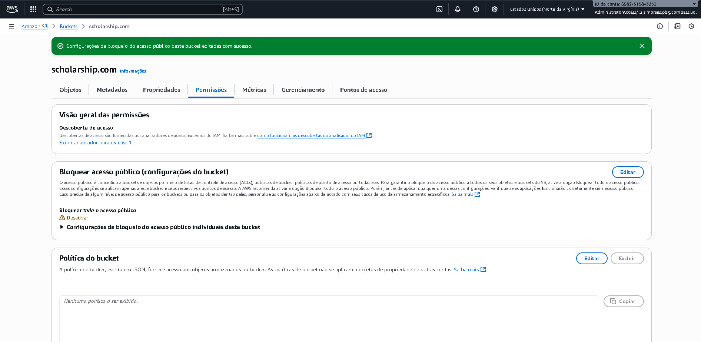  
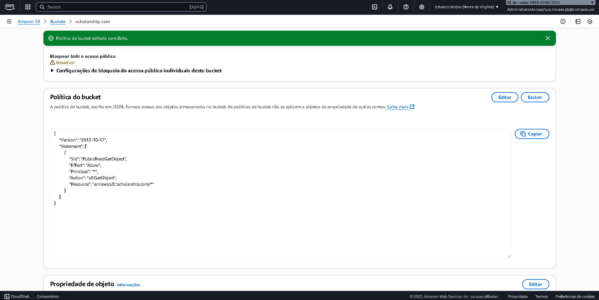  
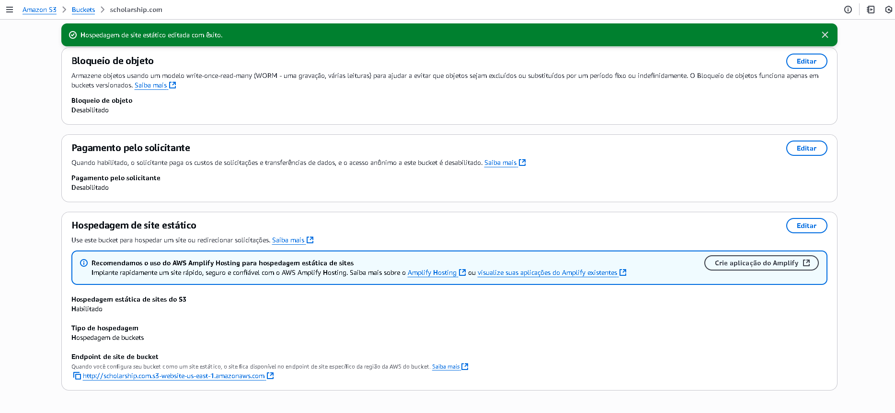  
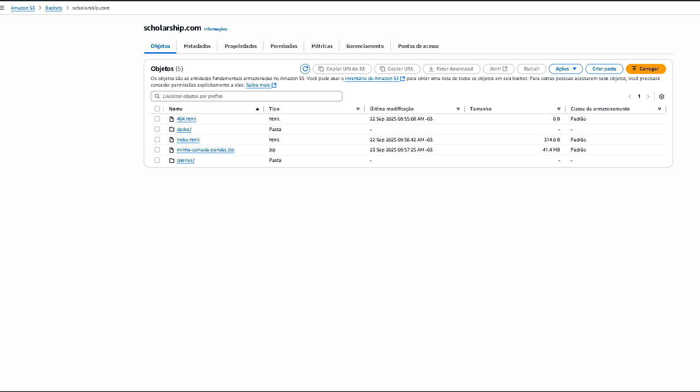  
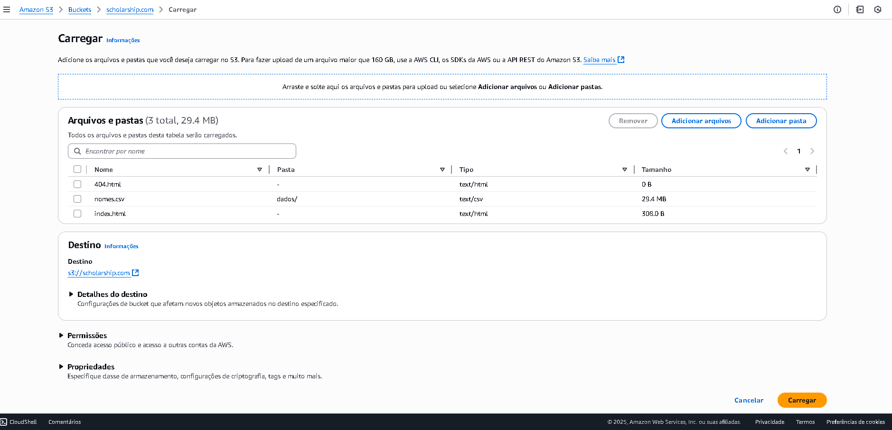  
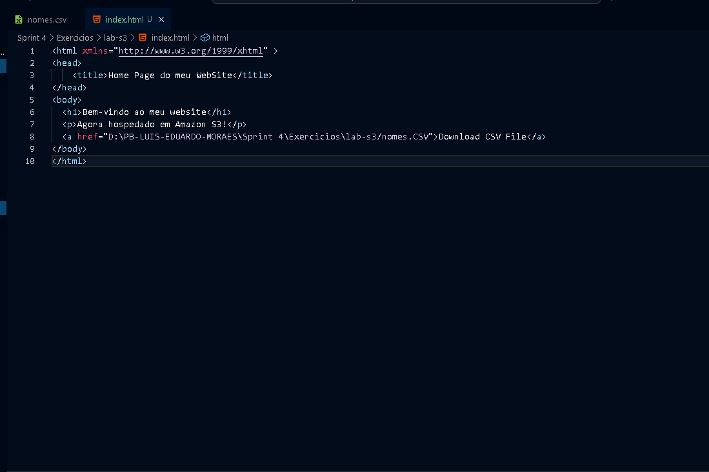  
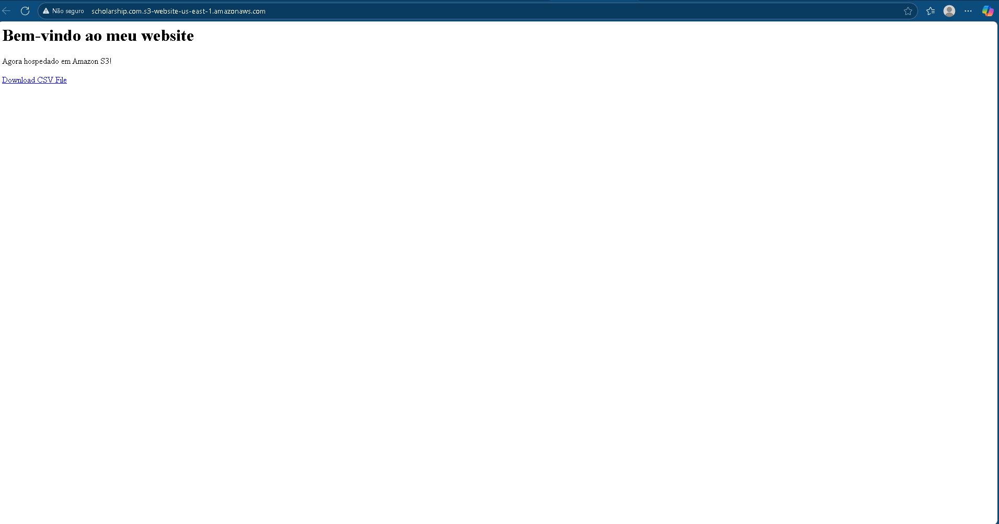  

---

### 🔹 Lab AWS Athena
- Criação de banco de dados `meubanco`.  
- Criação da tabela `nomes` baseada no CSV no S3.  
- Execução de queries SQL para explorar os dados.  

**Evidências:**  
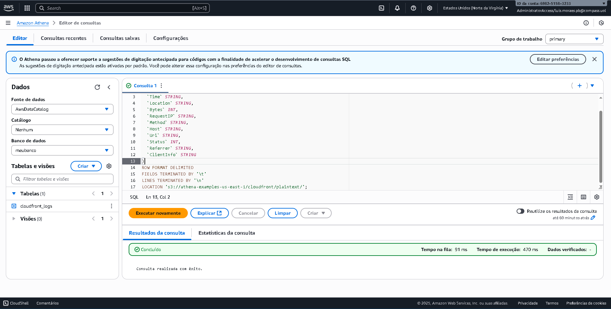  
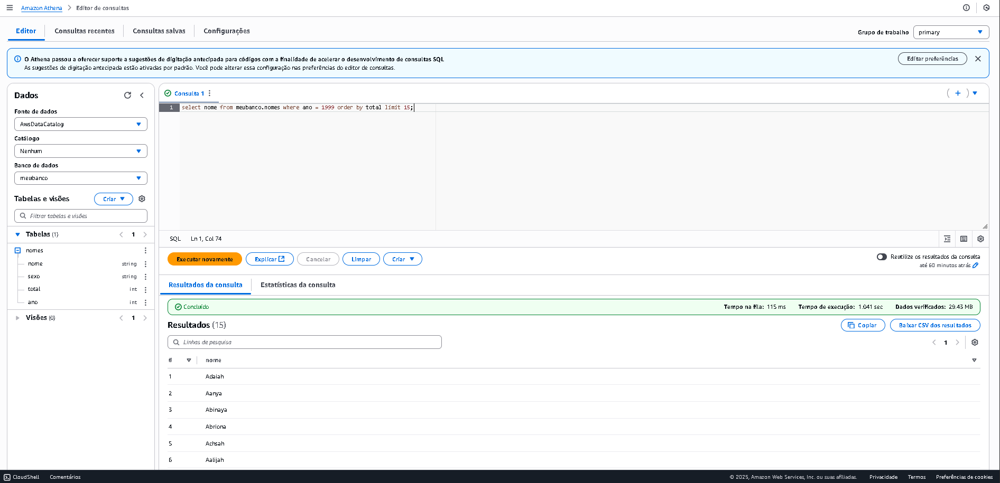  
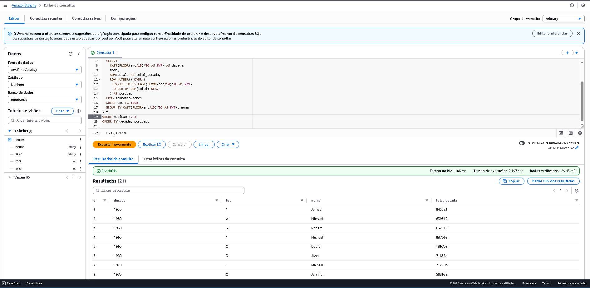  

---

### 🔹 Lab AWS Lambda + Docker
- Criação de função Lambda em Python 3.9.  
- Leitura de arquivo CSV diretamente do S3 usando Pandas.  
- Construção de uma Layer personalizada com Docker para importar Pandas/Numpy.  

**Evidências:**  
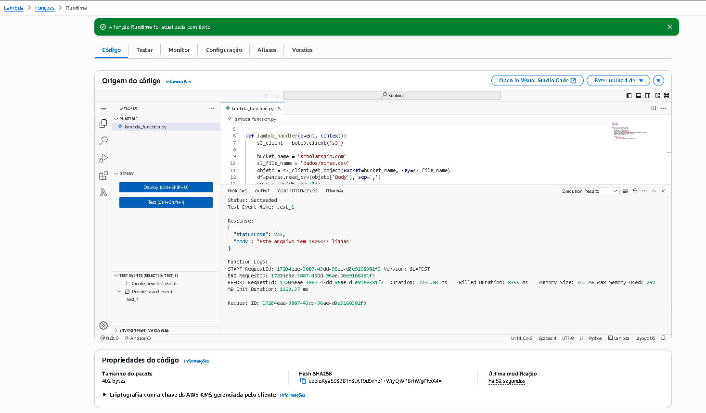  
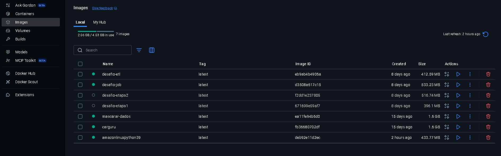  

---

## 🎯 Desafio Final

O desafio final teve como objetivo consolidar os conhecimentos em serviços AWS, integrando **S3**, **boto3** e **Python (Pandas)** para tratamento e análise de dados.

### 🔹 Etapa 1 – Upload do dataset
- Dataset escolhido: **Internações Hospitalares (CSV)**, obtido no portal [dados.gov.br](http://dados.gov.br).  
- Foi utilizado o script `upload-csv-sujo.py` para realizar o upload do arquivo **InternacoesHospitalares.csv** (versão original/suja) para um bucket S3 (`luis-sprint4`), garantindo automação via biblioteca **boto3**. 


``` 

import boto3

Configurações:

BUCKET_NAME = "luis-sprint4"
REGION = "us-east-1"
LOCAL_FILE = r"D:\PB-LUIS-EDUARDO-MORAES\Sprint 4\Desafio\etapa-1\InternacoesHospitalares.csv"
S3_KEY = "dados/InternacoesHospitalares.csv"

s3 = boto3.client("s3", region_name=REGION)

if REGION == "us-east-1":
    s3.create_bucket(Bucket=BUCKET_NAME)
else:
    s3.create_bucket(
        Bucket=BUCKET_NAME,
        CreateBucketConfiguration={"LocationConstraint": REGION}
    )
print(f"Bucket '{BUCKET_NAME}' criado.")  

s3.upload_file(LOCAL_FILE, BUCKET_NAME, S3_KEY)
print(f"Arquivo enviado para: s3://{BUCKET_NAME}/{S3_KEY}")
```


### 🔹 Etapa 2 – Limpeza e Análises
- Criado o notebook `limpeza.ipynb`, responsável por processar o CSV original e gerar a versão limpa do dataset.  
- O arquivo resultante foi salvo diretamente no bucket S3 em:  
  `luis-sprint4/dados_limpos/InternacoesHospitalares_limpo.csv`  
- O notebook `analises.ipynb` realizou as análises diretamente no arquivo limpo do S3, sem download local, incluindo:  
  1. **Filtro lógico**: pacientes do sexo feminino, com mais de 60 anos, residentes em Natal.  
     
  2. **Agregação**: quantidade de internações por especialidade.  
     )  
  3. **Função condicional**: classificação de pacientes em *Idoso* ou *Adulto* conforme a idade.  
       
  4. **Conversão de tipos**: idade convertida para string e novamente para numérico.  
       
  5. **Funções de data**: criação da coluna `mes_internacao`.  
       
  6. **Funções de string**: filtragem de especialidades que contenham o termo “CLÍNICA”.  
       

### 🔹 Etapa 3 – Execução 100% no S3
- O bucket manteve apenas os dois arquivos previstos:  
  - Arquivo original (**sujo**).  
  - Arquivo limpo gerado pelo ETL.  
- As consultas foram feitas diretamente sobre o arquivo limpo no S3, sem gravação de novos arquivos.  
- Evidências foram armazenadas em `Evidencias/Desafio/`.  

---

📂 **Arquivos do Desafio**  
- `Sprint4/Desafio/etapa-1/InternacoesHospitalares.csv`  
- `Sprint4/Desafio/etapa-1/upload-csv-sujo.py`  
- `Sprint4/Desafio/etapa-2/limpeza.ipynb`  
- `Sprint4/Desafio/etapa-2/analises.ipynb`  
- `s3://luis-sprint4/dados_limpos/InternacoesHospitalares_limpo.csv`  

---

✅ Com isso, todas as etapas do **Desafio Final** foram concluídas com sucesso, garantindo automação do upload, limpeza e análises dos dados **diretamente no S3**.

# ✅ Conclusão da Sprint
Sprint concluída com êxito até a fase de **cursos e exercícios práticos**.  
O **Desafio Final** será adicionado posteriormente como parte complementar da Sprint.  

---

# 🏆 Certificados
- AWS Cloud Quest: Cloud Practitioner – 12h 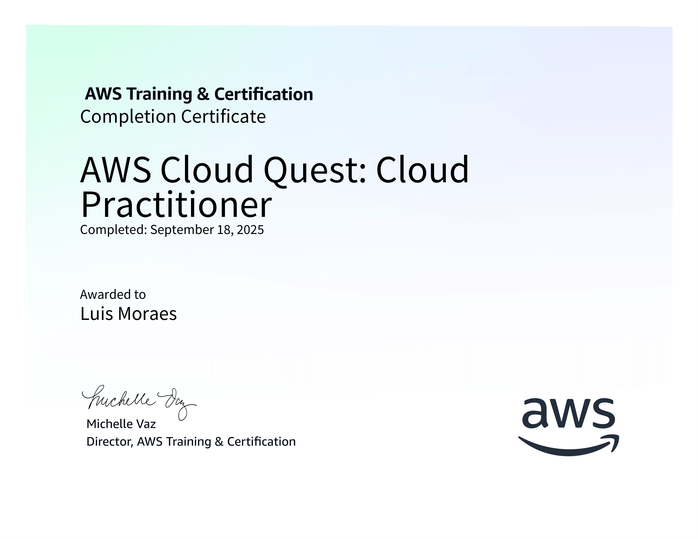
- AWS Skill Builder - AWS Partner: Sales Accreditation (Business) – 3h
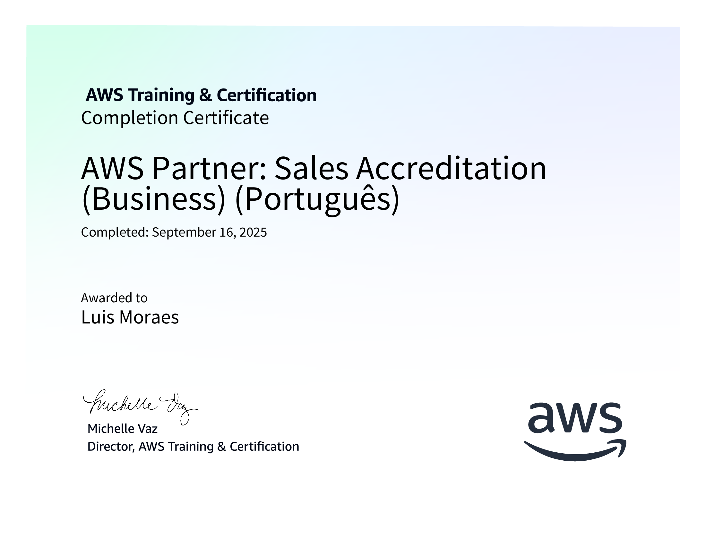  

- AWS Partner: Economias na nuvem AWS – 2h30 [Link para Badge curso Economias na nuvem](https://www.credly.com/badges/2ed59593-5b9a-4686-838a-d9a21b351860/public_url)
