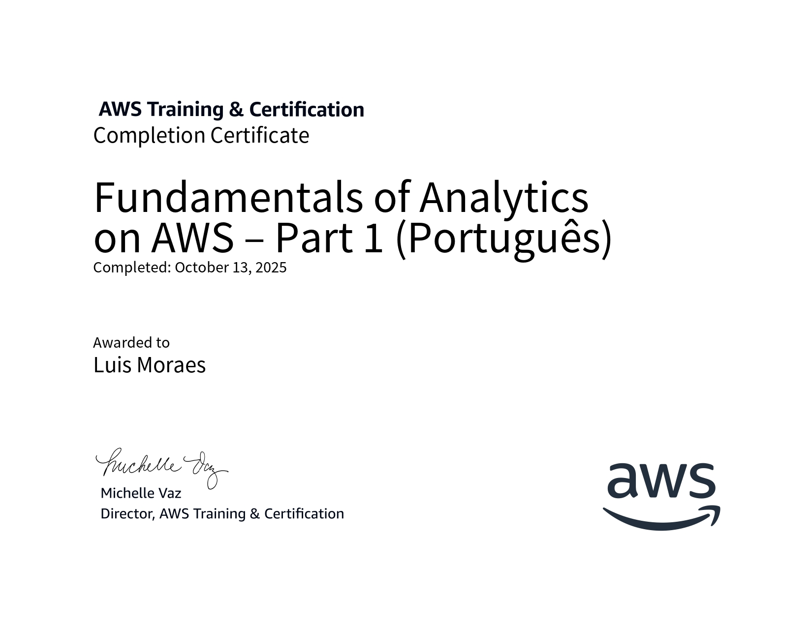
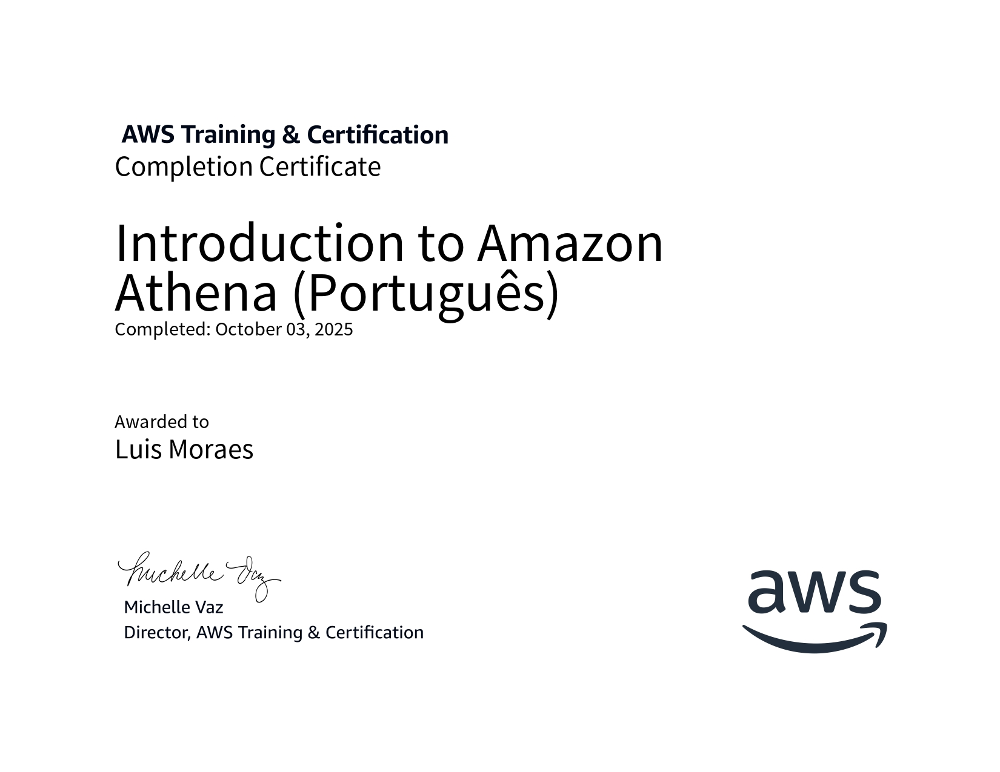
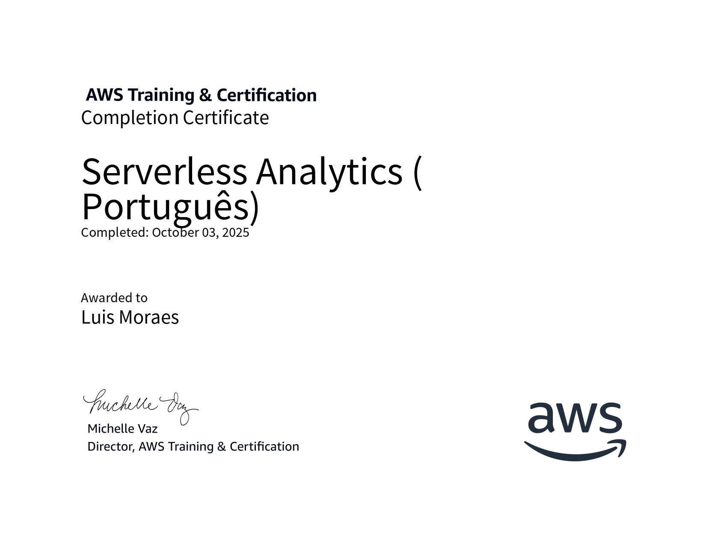

# 🚀 Sprint 5

## 📚 Conteúdos abordados
- Introdução ao **Apache Spark** e **PySpark** para processamento distribuído  
- Utilização do **Docker** para executar ambientes isolados com Spark  
- Criação de funções **AWS Lambda** integradas com **S3**  
- Armazenamento em camadas no **Data Lake** (Raw e Processed)  
- Consumo de dados pela **API do TMDB** com **Python + Requests**  
- Integração de ferramentas AWS com scripts em Python  
- Fundamentos de **análise de dados na nuvem (AWS Analytics)**  

---

## 🎓 Cursos realizados
Durante esta sprint, foram concluídos os seguintes cursos e formações:

1. 🧠 **Formação Spark com PySpark: o Curso Completo**  
2. 📊 **AWS Skill Builder – Fundamentals of Analytics on AWS – Part 1 (Portuguese)**  
3. 🧮 **AWS Skill Builder – Introduction to Amazon Athena (Portuguese)**  
4. ⚙️ **AWS Skill Builder – Serverless Analytics (Portuguese)**  

---

## 🧪 Exercícios realizados

### 🔹 Exercício 1 – Spark + Docker
Primeiro exercício prático com Docker e Spark.  
Foi executado o container do **Jupyter PySpark**, realizado o upload do arquivo `README.md`,  
e processado o conteúdo dentro do notebook para contagem de palavras.  

**Evidências:**  
`/Sprint 5/Evidencias/exercicio1/`

---

### 🔹 Exercício 2 – API TMDB
Criação de um script Python (`testapi.py`) para consumir a **API pública do TMDB**, retornando os filmes mais bem avaliados.  
O código utilizou as bibliotecas `requests` e `pandas`, exibindo os resultados em DataFrame.  

**Evidências:**  
`/Sprint 5/Evidencias/exercicio2/`

---

## 🎯 Desafio Final – Data Lake de Filmes e Séries

### 🔹 Etapa 1 – Ingestão de arquivos CSV
Upload dos arquivos `movies.csv` e `series.csv` para o bucket **data-lake-luis** usando Python + boto3,  
criando a camada **Raw/Local/CSV** no S3.  

### 🔹 Etapa 2 – Coleta da API TMDB com Lambda
Implementação de uma **função Lambda** configurada com variáveis de ambiente e permissões IAM,  
que realiza automaticamente a coleta de filmes por gênero (*Thriller* e *Horror*)  
e salva os resultados em formato JSON no S3:  

```
Raw/
 ├── Local/CSV/
 └── TMDB/JSON/
```

**Evidências:**  
- `/Sprint 5/Evidencias/desafio-etapa1/`  
- `/Sprint 5/Evidencias/desafio-etapa2/`

---

## ✅ Conclusão da Sprint
A Sprint 5 marcou o início da aplicação prática de conceitos de **Big Data e Analytics** com **AWS e Spark**.  
Foram realizados **4 cursos**, **2 exercícios práticos** e **1 desafio final**, integrando as principais tecnologias estudadas.  
Todas as entregas foram concluídas com sucesso! 🎉

---

 

**Evidências dos certificados:**  🏆
  
  
