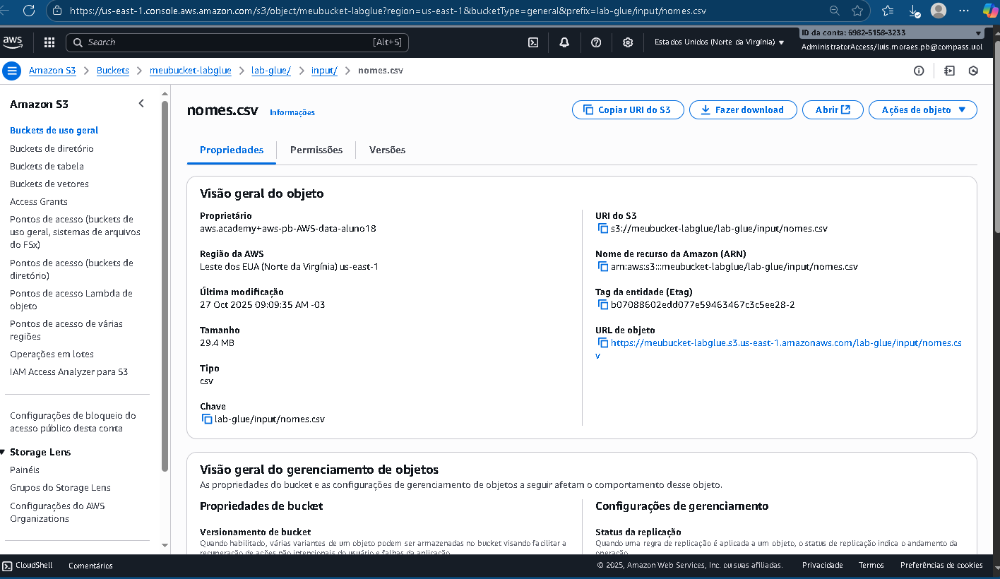
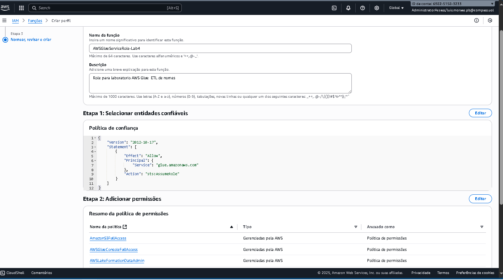
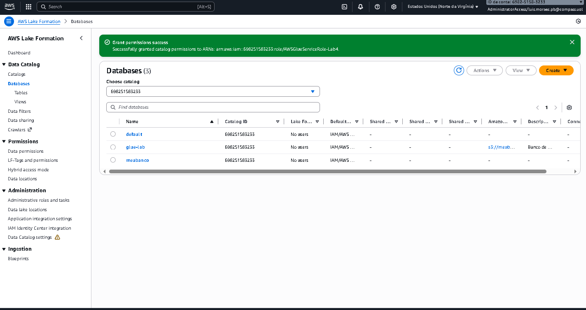
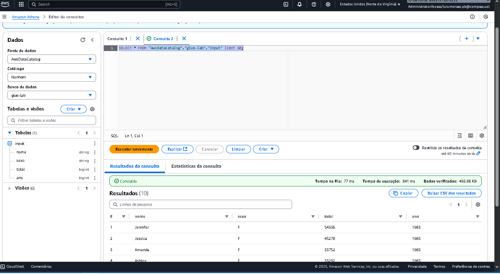
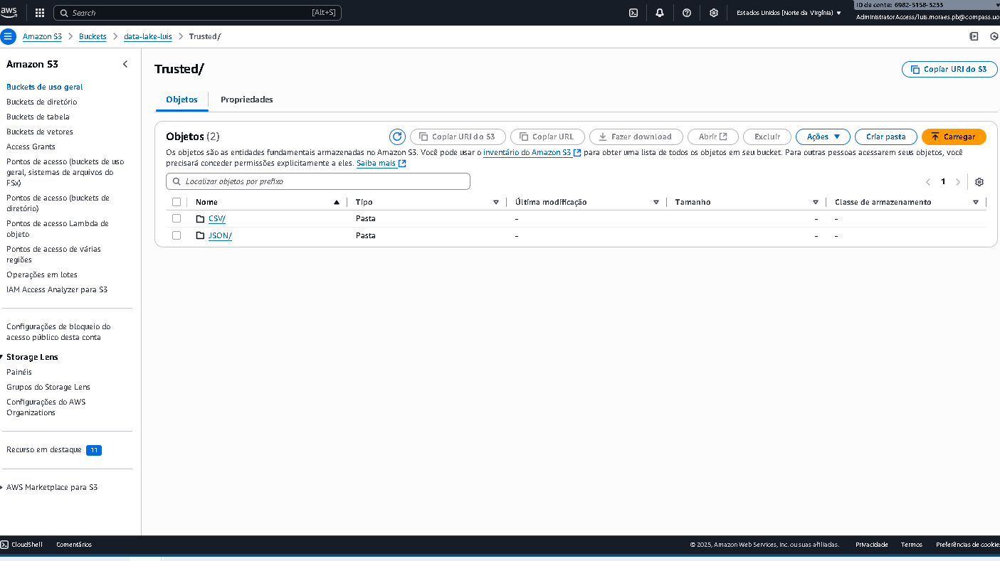
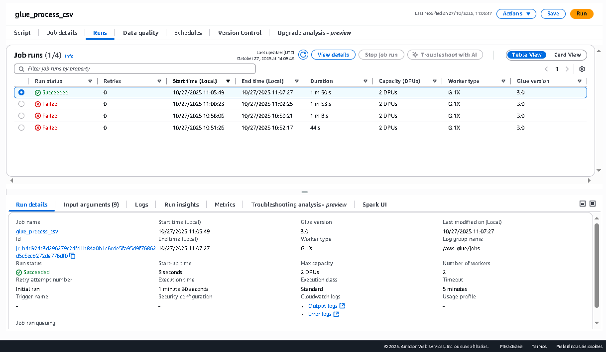
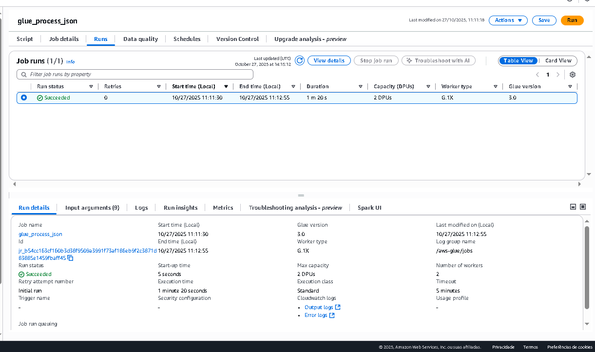

# 🚀 Sprint 6 – Apache Spark, PySpark e AWS Glue

## 📚 Conteúdos abordados
Durante esta sprint, o foco foi aplicar na prática conceitos de **Big Data e Processamento Distribuído**, integrando **Apache Spark**, **PySpark** e os serviços **AWS S3**, **Glue** e **IAM**.  
Os principais tópicos estudados foram:

- Fundamentos de **Apache Spark** e **PySpark**
- Geração e manipulação de dados com **Python**
- Criação de **pipelines de dados** usando **AWS Glue**
- Integração entre **camadas Raw e Trusted** no **Data Lake**
- Permissões e papéis via **AWS IAM e Lake Formation**
- Criação de jobs ETL e catálogos de dados na **AWS Glue Console**

---

## 🧠 Cursos Realizados

### 🔹 AWS Skill Builder – Fundamentals of Analytics on AWS (Part 2)
Aprendizado sobre o ecossistema analítico da AWS, abordando serviços como **Athena**, **QuickSight**, **Glue**, e boas práticas de arquitetura de dados.

📜 **Certificado:**

---

### 🔹 AWS Skill Builder – Getting Started with AWS Glue
Curso introdutório sobre o **AWS Glue**, cobrindo os conceitos de **Data Catalog**, **Crawlers**, **Jobs ETL** e **particionamento de dados** no S3.

📜 **Certificado:**

---

## 🧩 Exercícios Práticos

Durante os exercícios, foram trabalhados três grandes blocos de prática com Python, Spark e AWS:

### 🔹 Exercício 1 – Geração de Dados
Criação de scripts Python para gerar listas de números aleatórios, nomes e animais, salvando os resultados em arquivos `.txt`.

### 🔹 Exercício 2 – Manipulação com PySpark
Utilização do **PySpark** para criar DataFrames, aplicar filtros, gerar colunas aleatórias e realizar consultas SQL em grandes volumes de dados.

### 🔹 Exercício 3 – Laboratório AWS Glue
Configuração completa do ambiente AWS:
- Criação de bucket S3 (`meubucket-labglue`)
- Configuração de **IAM Role** e permissões no **Lake Formation**
- Criação de **Crawler**, **Banco de Dados**, e **Job ETL**
- Processamento de arquivo CSV no Glue e geração de tabela no Data Catalog

📸 **Evidências:**

---

## 🧩 Desafio Final – Entrega 3: Camada Trusted

### 🎯 Objetivo
Transformar os dados da **camada Raw** em uma **camada Trusted** no Data Lake, utilizando **AWS Glue Jobs Spark** para padronização e formatação em **Parquet**.

### ⚙️ Tecnologias e Processos
- AWS Glue (Jobs Spark, ETL e Data Catalog)
- Amazon S3 (camadas Raw e Trusted)
- Particionamento e compressão de dados com formato **Parquet (Snappy)**

### 📊 Estrutura no S3
Raw/Local/CSV/movies/2025/10/09/movies.csv
Raw/Local/CSV/series/2025/10/09/series.csv
Trusted/CSV/
Trusted/JSON/

---

📸 **Evidências:**

---

## ✅ Conclusão da Sprint

Nesta sprint foi consolidado o aprendizado sobre **processamento distribuído**, **integração entre serviços AWS** e **engenharia de dados**.  
Foram realizadas atividades práticas completas — desde a **geração de dados locais** até o **processamento e armazenamento padronizado em nuvem**.

💡 **Principais competências adquiridas:**
- Manipulação de grandes volumes de dados com Spark  
- Criação de pipelines ETL com AWS Glue  
- Organização de camadas Raw e Trusted no S3  
- Entendimento prático de permissões e papéis IAM  

🎯 **Sprint 6 concluída com sucesso!**
